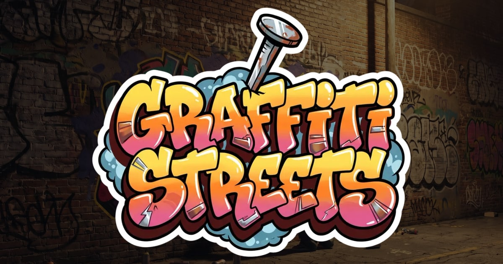

# Graffiti Streets

A short alley, two walls, and a spray can. Paint in the browser, photograph
what you made, and send it to the gallery.

**Play: [graffiti-streets.com](https://graffiti-streets.com)** ·
**Gallery: [graffiti-streets.com/gallery](https://graffiti-streets.com/gallery/)**



## What it is

A first-person painting toy built with Three.js. You walk (or fly) down a lit
alley at night and paint the walls. The can behaves like a can: the closer you
stand, the tighter and more saturated the cone, and holding still long enough
in one spot makes the paint run.

There is no score and nothing to win. The output is a photograph.

- **Caps** — circle, square and flare, whose width follows your distance to the
  wall, and roller, marker and calligraphy, which keep the width you set.
- **Paint runs** — hold in one place and it drips, wider at the top, tapering
  as it falls, in proportion to how long you held.
- **Two ways to move** — on foot, or free flight up to just above the wall.
- **Photograph** — press <kbd>P</kbd> and the frame is rendered again at a
  higher pixel ratio, so the picture is sharper than the screen it came from.
- **Two languages** — Portuguese and English, chosen from the browser and
  switchable in the menu.

## Running it

Node 20 or newer.

```bash
npm install
npm run dev
```

That is the whole setup. Configuration is optional — see
[.env.example](.env.example) — and a checkout with none of it still builds and
runs. What is not configured simply does not appear: no analytics id means no
tracker is ever loaded, no form URL means no button.

```bash
npm run typecheck   # tsc --noEmit
npm run build       # typecheck, then bundle into dist/
npm run preview     # serve the built site
```

## How it is put together

Read [ARCHITECTURE.md](ARCHITECTURE.md) first. The short version:

**Strokes are the source of truth, not pixels.** Painting never touches a
canvas directly — it produces a message, the message goes through
`Transport.send()`, and the wall redraws from the journal. That seam is why
undo is exact, why a wall can be rebuilt from nothing, and why multiplayer is a
different `Transport` rather than a rewrite.

**A wall side is one continuous surface.** Panels exist only so uploads can be
granular; the coordinate system runs across the whole strip, which is why a
stroke crossing a seam does not break.

**Every tunable number lives in [src/config.ts](src/config.ts).** Cap sizes,
spray falloff, drip growth, lamp candela, movement modes. Nothing is
hardcoded in a system.

Dependency direction is one-way: `ui/` → `paint/`/`player/` →
`world/`/`state/`/`net/` → `core/`/`config`.

The original specification, in Portuguese, is [context.md](context.md). It is
the only file in the repository that is not in English.

## Contributing

Bugs, ideas and pull requests are welcome — start with
[CONTRIBUTING.md](CONTRIBUTING.md).

## Licence

The code is under the **GNU Affero General Public License v3.0 or later**. See
[LICENSE](LICENSE).

In plain terms: you may use, study, change and redistribute it, and if you run
a modified version on a server that other people use, you have to offer them
your source too. That last part is what the *Affero* in the name is for, and it
is the reason this licence rather than a permissive one.

**The artwork is not covered by that licence.** The logo, the shark, the alley
photographs and every other image in [public/](public/) belong to the author
and are excluded — see [ASSETS.md](ASSETS.md). Fork the engine freely; bring
your own art.
